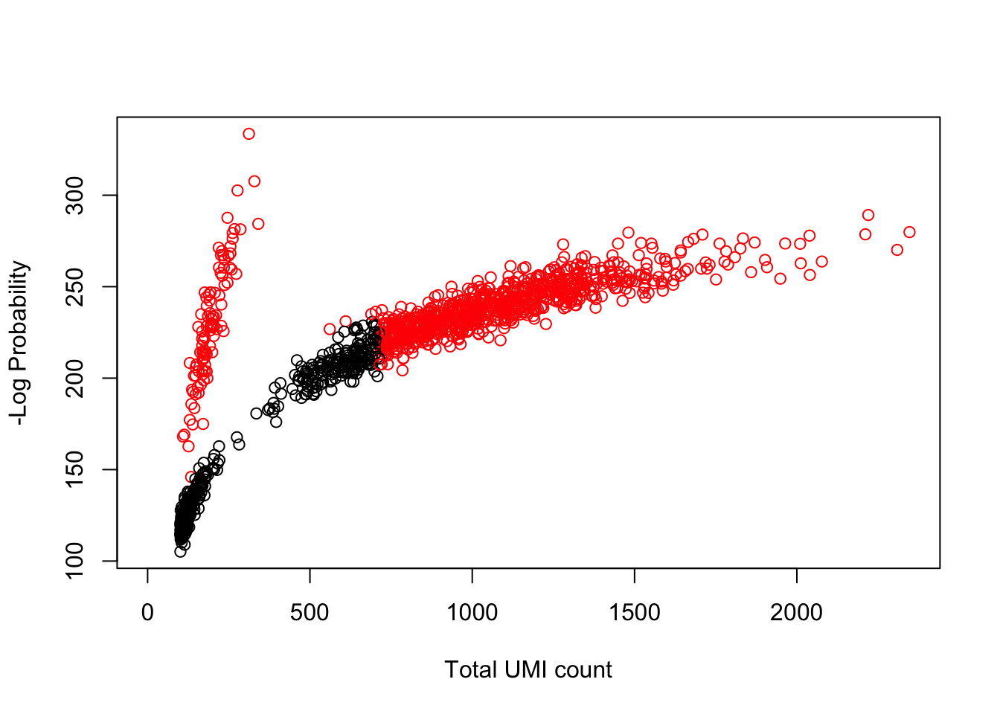

# Processing Raw scRNA-seq Data

Once you have obtained your single-cell RNA-seq data, 
it will typically be in "raw" form, meaning the raw 
sequencing reads will need to be to put through a set of 
quality control metrics to identify if any of your cells
need to be flagged as poor quality and maybe not included
in your downstream analysis. This is an essential step 
in the analysis of scRNA-seq data. 

For the purposes of this workshop, I will exclude this 
material and refer you to the original course material 
for a complete discussion: 

http://hemberg-lab.github.io/scRNA.seq.course/processing-raw-scrna-seq-data.html

However, I will give a broad overview of a workflow to 
pre-process raw sequencing reads and a brief explaination of 
file formats that you might come across. 

## Overview of pre-processing raw scRNA-seq data workflow 

Generally, a workflow would include: 

1. **Check the quality of the reads that you have sequenced**. [FastQC](https://www.bioinformatics.babraham.ac.uk/projects/fastqc/) is a good tool for this. This software produces a FastQC report than be used to evaluate questions such as _How good quality are the reads?_ _Is there anything we should be concerned about?_, etc.
2. **Trim sequencing adapaters from data**. For example, [Trim Galore!]() is wrapper for the reads trimming software [cutadapt](). Once you trim the adapaters, you can re-run FastQC to confirm successful removal. 
3. **Alignment and Quantification**. If you want to align reads to a reference genome, this is known as an alignment. Some form of alignment is generally required if we want to quantify gene expression or find genes which are differentially expressed between samples. STAR [@dobin] is an alignment tool that tries to find the longest possible sequence which matches one or more sequences in the reference genome for each read in our reads dataset. In contrast, you can also use pseudo-aligners such as Kallisto [@bray_2016] or Salmon, which are generally much faster. If you are interested in how this is acheived, see (Bray et al., 2017) for details.


## Overview of commonly used file formats

### FastQ
FastQ is the most raw form of scRNASeq data you will encounter. All scRNASeq 
protocols are sequenced with paired-end sequencing. Barcode sequences may occur 
in one or both reads depending on the protocol employed. However, protocols 
using unique molecular identifiers (UMIs) will generally contain one read with 
the cell and UMI barcodes plus adapters but without any transcript sequence. 
Thus reads will be mapped as if they are single-end sequenced despite actually
being paired end. 


### BAM

BAM file format stores mapped reads in a standard and efficient manner. The 
human-readable version is called a SAM file, while the BAM file is the highly
compressed version. BAM/SAM files contain a header which typically includes  
information on the sample preparation, sequencing and mapping; and a tab-separated row for each individual alignment of each read. 

Alignment rows employ a standard format with the following columns:

(1) QNAME : read name (generally will include UMI barcode if applicable)

(2) FLAG : number tag indicating the "type" of alignment, [link](https://broadinstitute.github.io/picard/explain-flags.html) to explanation of all possible "types"

(3) RNAME : reference sequence name (i.e. chromosome read is mapped to).

(4) POS : leftmost mapping position

(5) MAPQ : Mapping quality

(6) CIGAR : string indicating the matching/mismatching parts of the read (may include soft-clipping).

(7) RNEXT : reference name of the mate/next read

(8) PNEXT : POS for mate/next read

(9) TLEN : Template length (length of reference region the read is mapped to)

(10) SEQ : read sequence

(11) QUAL : read quality

BAM/SAM files can be converted to the other format using 'samtools':


```bash
samtools view -S -b file.sam > file.bam
samtools view -h file.bam > file.sam
```


### CRAM

[CRAM](https://www.ebi.ac.uk/ena/software/cram-usage) files are similar 
to BAM files only they contain information in the header 
to the reference genome used in the mapping in the header. This allow the bases
in each read that are identical to the reference to be further compressed. CRAM
also supports some lossy data compression approaches to further optimize storage
compared to BAMs. CRAMs are mainly used by the Sanger/EBI sequencing facility.


### Genome (FASTA, GTF)

To map your reads you will also need the reference genome and in many cases 
the genome annotation file (in either GTF or GFF format). These can be 
downloaded for model organisms from any of the main genomics databases: 
[Ensembl](http://www.ensembl.org/info/data/ftp/index.html), 
[NCBI](ftp://ftp.ncbi.nih.gov/genomes/), or [UCSC Genome Browser](http://hgdownload.soe.ucsc.edu/downloads.html). 

GTF files contain annotations of genes, transcripts, and exons. They must contain: 
(1) seqname : chromosome/scaffold 
(2) source : where this annotation came from
(3) feature : what kind of feature is this? (e.g. gene, transcript, exon)
(4) start : start position (bp)
(5) end : end position (bp)
(6) score : a number
(7) strand : + (forward) or - (reverse)
(8) frame : if CDS indicates which base is the first base of the first codon (0 = first base, 1 = second base, etc..)
(9) attribute : semicolon-separated list of tag-value pairs of extra information (e.g. names/IDs, biotype)

Empty fields are marked with "."

In our experience Ensembl is the easiest of these to use, and has the largest 
set of annotations. NCBI tends to be more strict in including only high 
confidence gene annotations. Whereas UCSC contains multiple geneset annotations
that use different criteria.

If you experimental system includes non-standard sequences these must be added 
to both the genome fasta and gtf to quantify their expression. Most commonly
this is done for the ERCC spike-ins, although the same must be done for CRISPR-
related sequences or other overexpression/reporter constructs. 

## Demultiplexing

Demultiplexing is done differently depending on the protocol used and the 
particular pipeline you are using a full pipeline. The most
flexible demultiplexing pipeline we are aware of is [zUMIs](https://github.com/sdparekh/zUMIs/wiki/Usage)
which can be used to demultiplex and map most UMI-based protocols. For Smartseq2 or 
other paired-end full transcript protocols the data will usually already be 
demultiplexed. Public repositories such as GEO or ArrayExpress require data 
small-scale/plate-based scRNASeq data to be demultiplexed prior to upload, 
and many sequencing facilities will automatically demultiplex data before 
returning it to you. If you aren't using a published pipeline and the data was
not demultiplexed by the sequencing facility you will have to demultiplex 
it yourself. This usually requires writing a custom script since barcodes
may be of different lengths and different locations in the reads depending 
on the protocols used.

For all data-type "demultiplexing" involves identifying and removing the 
cell-barcode sequence from one or both reads. If the expected 
cell-barcodes are known ahead of time, i.e. the data is from a PCR-plate-based 
protocol, all that is necessarily is to compare each cell-barcode to
the expected barcodes and assign the associated reads to the closest cell-barcode 
(with maximum mismatches of 1 or 2 depending on the design of the cell-barcodes). 
These data are generally demultiplexed prior to mapping as an easy way of 
parallelizing the mapping step. 

For UMI containing data, demultiplexing includes attaching the UMI code to the 
read name of the gene-body containing read. If the data are from a 
droplet-based protocol or SeqWell where the number of expected barcodes is 
much higher than the expected number of cell, then usually the cell-barcode 
will also be attached to the read name to avoid generating a very large number 
of files. In these cases, demultiplexing will happen during the 
quantification step to facilitate the identification of cell-barcodes which
correspond to intact cells rather than background noise.

For the purposes of this workshop, I will exclude this 
material and refer you to the original course material 
for a complete discussion for demultiplexing: 

http://hemberg-lab.github.io/scRNA.seq.course/processing-raw-scrna-seq-data.html


## Identifying cell-containing droplets/microwells

For droplet based methods only a fraction of droplets contain both beads 
and an intact cell. However, biology experiments are messy and some RNA will 
leak out of dead/damaged cells. So droplets without an intact cell are likely 
to capture a small amount of the ambient RNA which will end up in the sequencing 
library and contribute a reads to the final sequencing output. The variation in
droplet size, amplification efficiency, and sequencing will lead both 
"background" and real cells to have a wide range of library sizes. Various
approaches have been used to try to distinguish those cell barcodes which
correspond to real cells.

Most methods use the total molecules (could be applied to total reads) per 
barcode and try to find a "break point" between bigger 
libraries which are cells + some background and smaller libraries assumed 
to be purely background. One approach is to look for the inflection point
where the total molecules per barcode suddenly drops. 

Here we will use the `emptyDrops()` function in the R/Bioconductor package 
[DropletUtils](https://www.bioconductor.org/packages/3.7/bioc/html/DropletUtils.html)
to detect empty droplets (droplets that may contain RNA from the ambient solution, 
resulting in non-zero counts after debarcoding). The `emptyDrops()` function is designed 
to distinguish between empty droplets and cells. It does so by testing each barcode’s 
expression profile for significant deviation from the ambient profile. 

Let's try it out. First we load the package and simulate some UMI data using
`DropletUtils:::simCounts()` function. 


```r
require("DropletUtils")

set.seed(100)
my.counts <- DropletUtils:::simCounts()
```

How many unique barcodes were detected? 

```r
dim(my.counts)[1]
```

```
## [1] 100
```

How many true cells are present in the data?


```r
dim(my.counts)[2]
```

```
## [1] 11100
```


### How does `emptyDrops()` work? 

The function `emptyDrops()` uses the full genes x cells molecule 
count matrix for all droplets and estimates the profile of "background" 
RNA from those droplets with extremely low counts, then looks for
cells with gene-expression profiles which differ from the background. This is 
combined with an inflection point method since background RNA often looks very
similar to the expression profile of the largests cells in a population. As 
such `emptyDrops()` is the only method able to identify barcodes for very small
cells in highly diverse samples.


```r
e.out <- emptyDrops(my.counts)
is.cell <- e.out$FDR <= 0.01
sum(is.cell, na.rm=TRUE) # number of cells we believe 
```

```
## [1] 909
```

```r
plot(e.out$Total, -e.out$LogProb, col=ifelse(is.cell, "red", "black"),
    xlab="Total UMI count", ylab="-Log Probability")
```



