# Cleaning the expression matrix

## Expression QC 

### Introduction

Once gene expression has been quantified it is refer to it as 
an __expression matrix__ where each row corresponds to a gene
(or transcript) and each column corresponds to a single cell.
This matrix should be examined to remove poor quality cells 
which were not detected in either read QC or mapping QC steps.
Failure to remove low quality cells at this
stage may add technical noise which has the potential to obscure
the biological signals of interest in the downstream analysis. 

Since there is currently no standard method for performing scRNA-seq 
the expected values for the various QC measures that will be presented 
here can vary substantially from experiment to experiment. Thus, to 
perform QC we will be looking for cells which are outliers with 
respect to the rest of the dataset rather than comparing to 
independent quality standards. Consequently, care should be taken when 
comparing quality metrics across datasets collected using different protocols.


### Tung dataset (UMI)

To illustrate cell QC, we consider a
[dataset](http://jdblischak.github.io/singleCellSeq/analysis/) of
induced pluripotent stem cells generated from three different 
individuals [@Tung2017-ba] in 
[Yoav Gilad](http://giladlab.uchicago.edu/)'s lab at the
University of Chicago. The experiments were carried out on the
Fluidigm C1 platform and to facilitate the quantification both unique
molecular identifiers (UMIs) and ERCC _spike-ins_ were used. The data 
files are located in the `data/tung` folder in your working directory. 
These files are the copies of the original files made on the 15/03/16.
We will use these copies for reproducibility purposes.


```r
library(SingleCellExperiment)
library(scater)
options(stringsAsFactors = FALSE)
```

Load the data and annotations:

```r
molecules <- read.table("data/tung/molecules.txt", sep = "\t")
anno <- read.table("data/tung/annotation.txt", sep = "\t", header = TRUE)
```

Inspect a small portion of the expression matrix

```r
head(molecules[, 1:3])
```

```
##                 NA19098.r1.A01 NA19098.r1.A02 NA19098.r1.A03
## ENSG00000237683              0              0              0
## ENSG00000187634              0              0              0
## ENSG00000188976              3              6              1
## ENSG00000187961              0              0              0
## ENSG00000187583              0              0              0
## ENSG00000187642              0              0              0
```

```r
head(anno)
```

```
##   individual replicate well      batch      sample_id
## 1    NA19098        r1  A01 NA19098.r1 NA19098.r1.A01
## 2    NA19098        r1  A02 NA19098.r1 NA19098.r1.A02
## 3    NA19098        r1  A03 NA19098.r1 NA19098.r1.A03
## 4    NA19098        r1  A04 NA19098.r1 NA19098.r1.A04
## 5    NA19098        r1  A05 NA19098.r1 NA19098.r1.A05
## 6    NA19098        r1  A06 NA19098.r1 NA19098.r1.A06
```

The data consists of 3 individuals 
and 3 replicates and therefore has 
9 batches in total.

We standardize the analysis by using both `SingleCellExperiment` 
(SCE) and `scater` packages. First, create the SCE object:


```r
umi <- SingleCellExperiment(
    assays = list(counts = as.matrix(molecules)), 
    colData = anno
)
umi
```

```
## class: SingleCellExperiment 
## dim: 19027 864 
## metadata(0):
## assays(1): counts
## rownames(19027): ENSG00000237683 ENSG00000187634 ... ERCC-00170
##   ERCC-00171
## rowData names(0):
## colnames(864): NA19098.r1.A01 NA19098.r1.A02 ... NA19239.r3.H11
##   NA19239.r3.H12
## colData names(5): individual replicate well batch sample_id
## reducedDimNames(0):
## spikeNames(0):
```

Remove genes that are not expressed in any cell:

```r
keep_feature <- rowSums(counts(umi) > 0) > 0
umi <- umi[keep_feature, ]
```

Define control features (genes) - ERCC spike-ins and mitochondrial genes ([provided](http://jdblischak.github.io/singleCellSeq/analysis/qc-filter-ipsc.html) by the authors):

```r
isSpike(umi, "ERCC") <- grepl("^ERCC-", rownames(umi))
isSpike(umi, "MT") <- rownames(umi) %in% 
    c("ENSG00000198899", "ENSG00000198727", "ENSG00000198888",
    "ENSG00000198886", "ENSG00000212907", "ENSG00000198786",
    "ENSG00000198695", "ENSG00000198712", "ENSG00000198804",
    "ENSG00000198763", "ENSG00000228253", "ENSG00000198938",
    "ENSG00000198840")
```

Next we use the `calculateQCMetrics()` function in the 
scater package to calculate quality control metrics. 

We refer users to the `?calculateQCMetrics` for a full list of
the computed cell-level metrics. However, we will describe 
some of the more popular ones here. 

For example, some cell-level QC metrics are: 

* `total_counts`: total number of counts for the cell (i.e., the library size)
* `total_features_by_counts`: the number of features for the cell that have counts above the detection limit (default of zero)
* `pct_counts_X`: percentage of all counts that come from the feature control set named `X`

Some feature-level metrics include:

* `mean_counts`: the mean count of the gene/feature
* `pct_dropout_by_counts`: the percentage of cells with counts of zero for each gene
* `pct_counts_Y`: percentage of all counts that come from the cell control set named `Y`

Let's try calculating the quality metrics


```r
umi <- calculateQCMetrics(
    umi,
    feature_controls = list(
        ERCC = isSpike(umi, "ERCC"), 
        MT = isSpike(umi, "MT")
    )
)
umi
```

```
## class: SingleCellExperiment 
## dim: 18726 864 
## metadata(0):
## assays(1): counts
## rownames(18726): ENSG00000237683 ENSG00000187634 ... ERCC-00170
##   ERCC-00171
## rowData names(9): is_feature_control is_feature_control_ERCC ...
##   total_counts log10_total_counts
## colnames(864): NA19098.r1.A01 NA19098.r1.A02 ... NA19239.r3.H11
##   NA19239.r3.H12
## colData names(50): individual replicate ...
##   pct_counts_in_top_200_features_MT
##   pct_counts_in_top_500_features_MT
## reducedDimNames(0):
## spikeNames(2): ERCC MT
```

If `exprs_values` is set to something other than "counts", the 
names of the metrics will be changed by swapping "counts" for 
whatever named assay was used.

### Cell QC

#### Library size

Next we consider the total number of RNA molecules detected per
sample (if we were using read counts rather than UMI counts this would
be the total number of reads). Wells with few reads/molecules 
are likely to have been broken or failed to capture a cell, 
and should thus be removed.


```r
hist(
    umi$total_counts,
    breaks = 100
)
abline(v = 25000, col = "red")
```

<div class="figure" style="text-align: center">
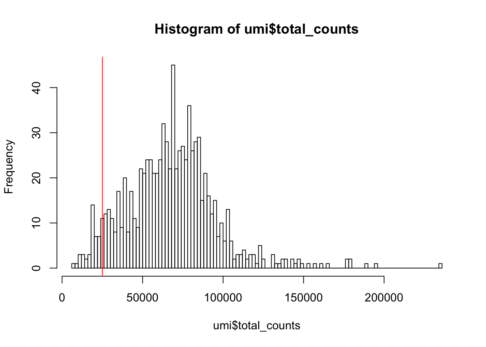
<p class="caption">(\#fig:total-counts-hist)Histogram of library sizes for all cells</p>
</div>

How many cells does our filter remove?


```r
filter_by_total_counts <- (umi$total_counts > 25000)
table(filter_by_total_counts)
```

```
## filter_by_total_counts
## FALSE  TRUE 
##    46   818
```

#### Detected genes

In addition to ensuring sufficient sequencing depth for each 
sample, we also want to make sure that the reads are distributed 
across the transcriptome. Thus, we count the total number of
unique genes detected in each sample.


```r
hist(
    umi$total_features_by_counts,
    breaks = 100
)
abline(v = 7000, col = "red")
```

<div class="figure" style="text-align: center">

<p class="caption">(\#fig:total-features-hist)Histogram of the number of detected genes in all cells</p>
</div>

From the plot we conclude that most cells have between 7,000-10,000 
detected genes,which is normal for high-depth scRNA-seq. However, 
this varies byexperimental protocol and sequencing depth. For 
example, droplet-based methods or samples with lower sequencing-depth
typically detect fewer genes per cell. The most notable feature 
in the above plot is the __"heavy tail"__ on the left hand side of the
distribution. If detection rates were equal across the cells then the
distribution should be approximately normal. Thus we remove those
cells in the tail of the distribution (fewer than 7,000 detected genes).

How many cells does our filter remove?


```r
filter_by_expr_features <- (umi$total_features_by_counts > 7000)
table(filter_by_expr_features)
```

```
## filter_by_expr_features
## FALSE  TRUE 
##   116   748
```

#### ERCCs and MTs

Another measure of cell quality is the ratio between ERCC _spike-in_
RNAs and endogenous RNAs. This ratio can be used to estimate the total amount
of RNA in the captured cells. Cells with a high level of _spike-in_ RNAs
had low starting amounts of RNA, likely due to the cell being
dead or stressed which may result in the RNA being degraded.


```r
plotColData(
    umi,
    x = "total_features_by_counts",
    y = "pct_counts_MT",
    colour = "batch"
)
```

<div class="figure" style="text-align: center">

<p class="caption">(\#fig:mt-vs-counts)Percentage of counts in MT genes</p>
</div>


```r
plotColData(
    umi,
    x = "total_features_by_counts",
    y = "pct_counts_ERCC",
    colour = "batch"
)
```

<div class="figure" style="text-align: center">

<p class="caption">(\#fig:ercc-vs-counts)Percentage of counts in ERCCs</p>
</div>

The above analysis shows that majority of the cells from `NA19098.r2`
batch have a very high ERCC/Endo ratio. Indeed, it has been shown by the 
authors that this batch contains cells of smaller size. 

Let's create filters for removing batch `NA19098.r2` and cells with
high expression of mitochondrial genes (>10% of total counts in a cell).


```r
filter_by_ERCC <- umi$batch != "NA19098.r2"
table(filter_by_ERCC)
```

```
## filter_by_ERCC
## FALSE  TRUE 
##    96   768
```

```r
filter_by_MT <- umi$pct_counts_MT < 10
table(filter_by_MT)
```

```
## filter_by_MT
## FALSE  TRUE 
##    31   833
```


### Cell filtering

#### Manual

Now we can define a cell filter based on our previous analysis:


```r
umi$use <- (
    # sufficient features (genes)
    filter_by_expr_features &
    # sufficient molecules counted
    filter_by_total_counts &
    # sufficient endogenous RNA
    filter_by_ERCC &
    # remove cells with unusual number of reads in MT genes
    filter_by_MT
)
```


```r
table(umi$use)
```

```
## 
## FALSE  TRUE 
##   207   657
```


#### Automatic

Another option available in `scater` is to conduct PCA on 
a set of QC metrics and then use automatic outlier detection
to identify potentially problematic cells. 

By default, the following metrics are used for PCA-based outlier detection:

* __pct_counts_top_100_features__
* __total_features__
* __pct_counts_feature_controls__
* __n_detected_feature_controls__
* __log10_counts_endogenous_features__
* __log10_counts_feature_controls__

`scater` first creates a matrix where the rows represent cells and
the columns represent the different QC metrics. Then, outlier cells 
can also be identified by using the `mvoutlier` package
on the QC metrics for all cells. This will identify cells that have 
substantially different QC metrics from the others, possibly corresponding 
to low-quality cells. We can visualize any outliers using a 
principal components plot as shown below:


```r
umi <- runPCA(umi, use_coldata = TRUE, 
              detect_outliers = TRUE)
reducedDimNames(umi)
```

```
## [1] "PCA_coldata"
```

Column subsetting can then be performed based on the `$outlier` 
slot, which indicates whether or not each cell has been 
designated as an outlier. Automatic outlier detection can 
be informative, but a close inspection of QC metrics and 
tailored filtering for the specifics of the dataset at 
hand is strongly recommended.


```r
table(umi$outlier)
```

```
## 
## FALSE  TRUE 
##   791    73
```

Then, we can use a PCA plot to see a 2D representation 
of the cells ordered by their quality metrics.


```r
plotReducedDim(umi, use_dimred = "PCA_coldata",
               size_by = "total_features_by_counts", 
               shape_by = "use", 
               colour_by="outlier")
```


### Compare filterings

We can compare the default, automatic and manual cell filters.
Plot a Venn diagram of the outlier cells from these filterings.

We will use `vennCounts()` and `vennDiagram()` functions from the
[limma](https://bioconductor.org/packages/release/bioc/html/limma.html)
package to make a Venn diagram.

<div class="figure" style="text-align: center">
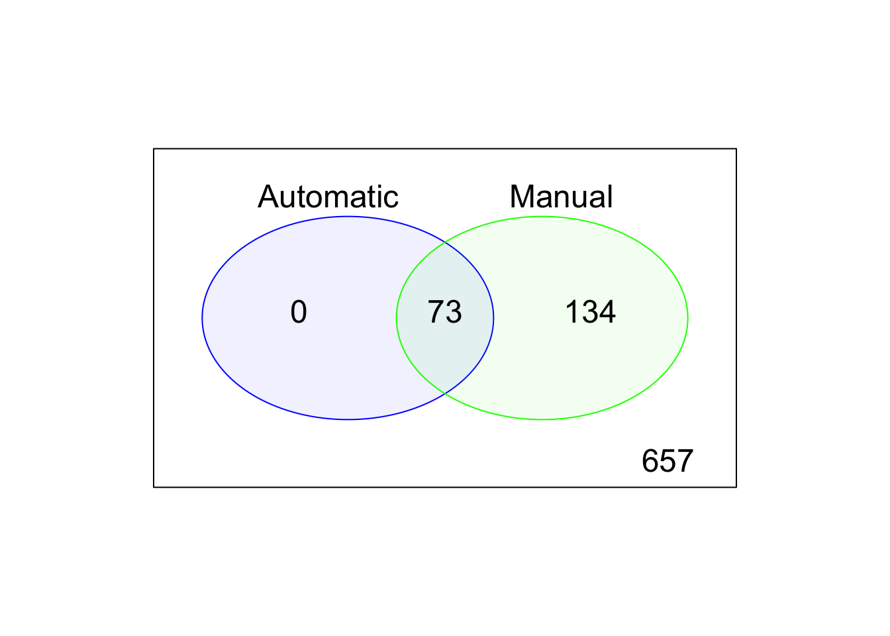
<p class="caption">(\#fig:cell-filt-comp)Comparison of the default, automatic and manual cell filters</p>
</div>

### Gene analysis

#### Gene expression

In addition to removing cells with poor quality, it is usually a
good idea to exclude genes where we suspect that technical 
artefacts may have skewed the results. Moreover, inspection 
of the gene expression profiles may provide insights about 
how the experimental procedures could be improved.

It is often instructive to consider a plot that shows the
top 50 (by default) most-expressed features. Each row in the 
plot below corresponds to a gene, and each bar corresponds to 
the expression of a gene in a single cell. The circle indicates 
the median expression of each gene, with which genes are sorted. 
By default, "expression" is defined using the feature counts 
(if available), but other expression values can be used instead 
by changing exprs_values.


```r
plotHighestExprs(umi, exprs_values = "counts")
```

<div class="figure" style="text-align: center">

<p class="caption">(\#fig:top50-gene-expr)Number of total counts consumed by the top 50 expressed genes</p>
</div>

A few spike-in transcripts may also be present here, though 
if all of the spike-ins are in the top 50, it suggests that 
too much spike-in RNA was added and a greater dilution of the
spike-ins may be preferrable if the experiment is to be repeated.
A large number of pseudo-genes or predicted genes may indicate 
problems with alignment.


#### Gene filtering

It is typically a good idea to remove genes whose expression level 
is considered __"undetectable"__. We define a gene as detectable if 
at least two cells contain more than 1 transcript from the gene. If
we were considering read counts rather than UMI counts a reasonable
threshold is to require at least five reads in at least two cells.
However, in both cases the threshold strongly depends on the 
sequencing depth. It is important to keep in mind that genes must be 
filtered after cell filtering since some genes may only be detected
in poor quality cells (__note__ `colData(umi)$use` filter applied 
to the `umi` dataset).

In the example below, genes are only retained if they are expressed 
in two or more cells with more than 1 transcript:


```r
keep_feature <- nexprs(umi[,colData(umi)$use], byrow=TRUE, 
                       detection_limit=1) >= 2
rowData(umi)$use <- keep_feature
```


```r
table(keep_feature)
```

```
## keep_feature
## FALSE  TRUE 
##  4660 14066
```

Depending on the cell-type, protocol and sequencing depth, 
other cut-offs may be appropriate.

Before we leave this section, we can check the 
dimensions of the QCed dataset (do not forget about the 
gene filter we defined above):

```r
dim(umi[rowData(umi)$use, colData(umi)$use])
```

```
## [1] 14066   657
```

Let's create an additional slot with log-transformed counts (we
will need it in the next sections):

```r
assay(umi, "logcounts_raw") <- log2(counts(umi) + 1)
```


## Data visualization

### Introduction

In this section, we will continue to work with the filtered 
`Tung` dataset produced in the previous section. We will explore 
different ways of visualizing the data to allow you to asses 
what happened to the expression matrix after the quality control
step. `scater` package provides several very useful functions 
to simplify visualisation. 

One important aspect of single-cell RNA-seq is to control for 
batch effects. Batch effects are technical artefacts that are 
added to the samples during handling. For example, if two sets 
of samples were prepared in different labs or even on different 
days in the same lab, then we may observe greater similarities
between the samples that were handled together. In the worst 
case scenario, batch effects may be 
[mistaken](http://f1000research.com/articles/4-121/v1) 
for true biological variation. The `Tung` data allows us to 
explore these issues in a controlled manner since some of the 
salient aspects of how the samples were handled have been 
recorded. Ideally, we expect to see batches from the same
individual grouping together and distinct groups corresponding 
to each individual. 


```r
umi.qc <- umi[rowData(umi)$use, colData(umi)$use]
endog_genes <- !rowData(umi.qc)$is_feature_control
```

### PCA plot

The easiest way to overview the data is by transforming it using the
principal component analysis and then visualize the first two principal components.

[Principal component analysis (PCA)](https://en.wikipedia.org/wiki/Principal_component_analysis) 
is a statistical procedure that uses a transformation to convert
a set of observations into a set of values of linearly uncorrelated
variables called principal components (PCs). The number of principal 
components is less than or equal to the number of original variables.

Mathematically, the PCs correspond to the eigenvectors of the 
covariance matrix. The eigenvectors are sorted by eigenvalue 
so that the first principal component accounts for as much 
of the variability in the data as possible, and each succeeding
component in turn has the highest variance possible under the
constraint that it is orthogonal to the preceding components 
(the figure below is taken from [here](http://www.nlpca.org/pca_principal_component_analysis.html)).

<div class="figure" style="text-align: center">

<p class="caption">(\#fig:clust-pca)Schematic representation of PCA dimensionality reduction</p>
</div>

#### Before QC

Without log-transformation:

```r
plotPCA(
    umi[endog_genes, ],
    colour_by = "batch", 
    size_by = "total_features_by_counts",
    shape_by = "individual", 
run_args=list(exprs_values="counts")
)
```

<div class="figure" style="text-align: center">
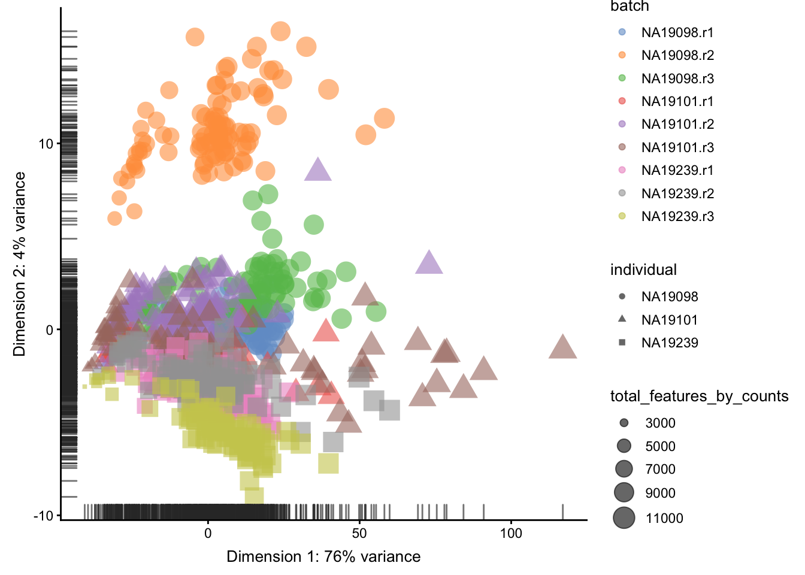
<p class="caption">(\#fig:expr-overview-pca-before-qc1)PCA plot of the tung data</p>
</div>

With log-transformation:

```r
plotPCA(
    umi[endog_genes, ],
    colour_by = "batch", 
    size_by = "total_features_by_counts",
    shape_by = "individual", 
run_args=list(exprs_values="logcounts_raw")
)
```

<div class="figure" style="text-align: center">

<p class="caption">(\#fig:expr-overview-pca-before-qc2)PCA plot of the tung data</p>
</div>

Clearly log-transformation is benefitial for our data.
It reduces the variance on the first principal component
and already separates some biological effects. Moreover, 
it makes the distribution of the expression values more 
normal. In the following analysis and sections we will 
be using log-transformed raw counts by default.

__However, note that just a log-transformation is not enough to account for different technical factors between the cells (e.g. sequencing depth). Therefore, please do not use `logcounts_raw` for your downstream analysis, instead as a minimum suitable data use the `logcounts` slot of the `SingleCellExperiment` object, which not just log-transformed, but also normalised by library size (e.g. CPM normalisation). For the moment, we use `logcounts_raw` only for demonstration purposes!__

#### After QC


```r
plotPCA(
    umi.qc[endog_genes, ],
    colour_by = "batch", 
    size_by = "total_features_by_counts",
    shape_by = "individual", 
    run_args=list(exprs_values="logcounts_raw")
)
```

<div class="figure" style="text-align: center">
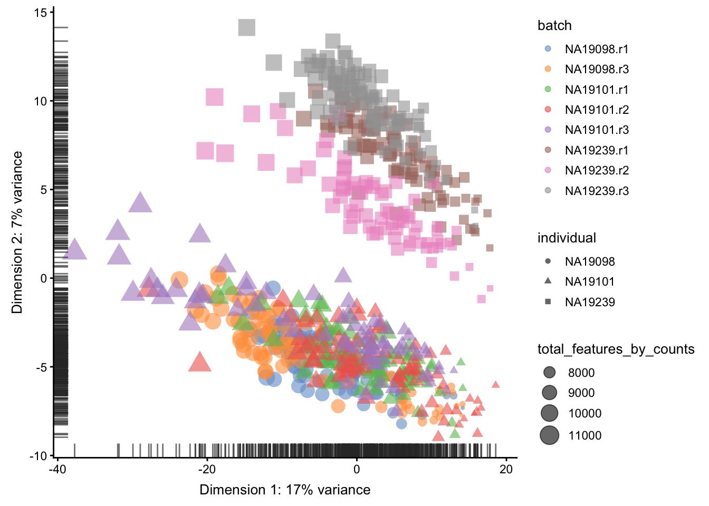
<p class="caption">(\#fig:expr-overview-pca-after-qc)PCA plot of the tung data</p>
</div>

Comparing Figure \@ref(fig:expr-overview-pca-before-qc2)
and Figure \@ref(fig:expr-overview-pca-after-qc), it is
clear that after quality control the `NA19098.r2` cells
no longer form a group of outliers.

By default only the top 500 most variable genes are used 
by scater to calculate the PCA. This can be adjusted by 
changing the `ntop` argument. 


### tSNE map 

An alternative to PCA for visualizing scRNASeq data 
is a tSNE plot. [tSNE](https://lvdmaaten.github.io/tsne/) 
(t-Distributed Stochastic Neighbor Embedding) combines 
dimensionality reduction (e.g. PCA) with random walks on 
the nearest-neighbour network to map high dimensional data 
(i.e. our 14,214 dimensional expression matrix) to a 
2-Dimensional space while preserving local distances between
cells. In contrast with PCA, tSNE is a stochastic algorithm 
which means running the method multiple times on the same 
dataset will result in different plots. Due to the non-linear 
and stochastic nature of the algorithm, tSNE is more difficult
to intuitively interpret tSNE. To ensure reproducibility, we
fix the "seed" of the random-number generator in the code 
below so that we always get the same plot. 


#### Before QC


```r
set.seed(123456)
plotTSNE(
    umi[endog_genes, ],
    colour_by = "batch",
    size_by = "total_features_by_counts",
    shape_by = "individual",
    run_args=list(exprs_values="logcounts_raw", 
                  perplexity = 130)
)
```

<div class="figure" style="text-align: center">
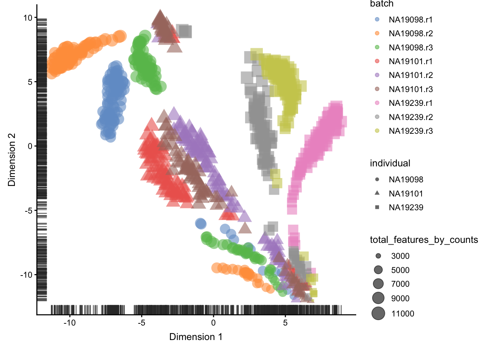
<p class="caption">(\#fig:expr-overview-tsne-before-qc)tSNE map of the tung data</p>
</div>

#### After QC


```r
set.seed(123456)
plotTSNE(
    umi.qc[endog_genes, ],
    colour_by = "batch",
    size_by = "total_features_by_counts",
    shape_by = "individual",
    run_args=list(exprs_values="logcounts_raw", 
                  perplexity = 130)
)
```

<div class="figure" style="text-align: center">

<p class="caption">(\#fig:expr-overview-tsne-after-qc)tSNE map of the tung data</p>
</div>

Interpreting PCA and tSNE plots is often challenging 
and due to their stochastic and non-linear nature, 
they are less intuitive. However, in this case it is 
clear that they provide a similar picture of the data.
Comparing Figure \@ref(fig:expr-overview-tsne-before-qc) 
and \@ref(fig:expr-overview-tsne-after-qc), it is again 
clear that the samples from `NA19098.r2` are no longer 
outliers after the QC filtering.

Furthermore tSNE requires you to provide a value of
`perplexity` which reflects the number of neighbours used 
to build the nearest-neighbour network; a high value 
creates a dense network which clumps cells together 
while a low value makes the network more sparse allowing
groups of cells to separate from each other. `scater` 
uses a default perplexity of the total number of cells
divided by five (rounded down).

You can read more about the pitfalls of using tSNE 
[here](http://distill.pub/2016/misread-tsne/).

As an exercise, I will leave it up to you explore how
the tSNE plots change when a perplexity of 10 or 200 
is used. How does the choice of perplexity affect the 
interpretation of the results?


## Identifying confounding factors

### Introduction

There is a large number of potential confounders, artifacts 
and biases in sc-RNA-seq data. One of the main challenges in 
analyzing scRNA-seq data stems from the fact that it is 
difficult to carry out a true technical replicate (why?) 
to distinguish biological and technical variability. In 
the previous sections we considered batch effects and in 
this section we will continue to explore how experimental 
artifacts can be identified and removed. We will continue 
using the `scater` package since it provides a set of methods 
specifically for quality control of experimental and
explanatory variables. Moreover, we will continue to work with
the Blischak data that was used in the previous section.

Recall that the `umi.qc` dataset contains filtered cells and
genes. Our next step is to explore technical drivers of 
variability in the data to inform data normalisation before
downstream analysis.

### Correlations with PCs

Let's first look again at the PCA plot of the QCed dataset:

```r
plotPCA(
    umi.qc[endog_genes, ],
    colour_by = "batch",
    size_by = "total_features_by_counts",
    run_args=list(exprs_values="logcounts_raw")
)
```

<div class="figure" style="text-align: center">

<p class="caption">(\#fig:confound-pca)PCA plot of the tung data</p>
</div>

`scater` allows one to identify principal components
that correlate with experimental and QC variables of
interest (it ranks principle components by $R^2$ from 
a linear model regressing PC value against the
variable of interest).

Let's test whether some of the variables correlate
with any of the PCs.

#### Detected genes


```r
plotExplanatoryPCs(
    umi.qc[endog_genes, ],
    variables = "total_features_by_counts",
    exprs_values="logcounts_raw")
```

<div class="figure" style="text-align: center">

<p class="caption">(\#fig:confound-find-pcs-total-features)PC correlation with the number of detected genes</p>
</div>

Indeed, we can see that `PC1` can be almost completely
explained by the number of detected genes. In fact, 
it was also visible on the PCA plot above. This is a
well-known issue in scRNA-seq and was described
[@Hicks:2018aa] [or here](http://biorxiv.org/content/early/2015/12/27/025528).

### Explanatory variables

`scater` can also compute the marginal $R^2$ for each 
variable when fitting a linear model regressing 
expression values for each gene against just that
variable, and display a density plot of the gene-wise 
marginal $R^2$ values for the variables.


```r
plotExplanatoryVariables(
    umi.qc[endog_genes, ],
      variables = c(
        "total_features_by_counts",
        "total_counts",
        "batch",
        "individual",
        "pct_counts_ERCC",
        "pct_counts_MT"
    ),
    exprs_values="logcounts_raw")
```

<div class="figure" style="text-align: center">

<p class="caption">(\#fig:confound-find-expl-vars)Explanatory variables</p>
</div>

This analysis indicates that the number of detected 
genes (again) and also the sequencing depth (number of 
counts) have substantial explanatory power for many genes,
so these variables are good candidates for conditioning 
out in a normalisation step, or including in downstream 
statistical models. Expression of ERCCs also appears to 
be an important explanatory variable and one notable 
feature of the above plot is that batch explains more 
than individual. 


## Normalization theory

### Introduction


In the previous section, we identified important confounding
factors and explanatory variables. `scater` allows one to 
account for these variables in subsequent statistical models 
or to condition them out using `normaliseExprs()`, if so desired.
This can be done by providing a design matrix to `normaliseExprs()`.
We are not covering this topic here, but you can try to do it
yourself as an exercise.

Instead we will explore how simple size-factor normalisations 
correcting for library size can remove the effects of some
of the confounders and explanatory variables.

### Library size

Library sizes vary because scRNA-seq data is often 
sequenced on highly multiplexed platforms the total 
reads which are derived from each cell may differ substantially. 
Some quantification methods
(eg. [`Cufflinks`](http://cole-trapnell-lab.github.io/cufflinks/), [`RSEM`](http://deweylab.github.io/RSEM/)) incorporated 
library size when determining gene expression estimates 
thus do not require this normalization.

However, if another quantification method was used then
library size must be corrected for by multiplying or 
dividing each column of the expression matrix by a 
"normalization factor" which is an estimate of the 
library size relative to the other cells. Many methods
to correct for library size have been developped for 
bulk RNA-seq and can be equally applied to scRNA-seq 
(eg. __UQ__, __SF__, __CPM__, __RPKM__, __FPKM__, __TPM__). 


### Normalisations

#### CPM

The simplest way to normalize this data is to convert it 
to counts per million (__CPM__) by dividing each column by 
its total then multiplying by 1,000,000. Note that spike-ins 
should be excluded from the calculation of total expression 
in order to correct for total cell RNA content, therefore we
will only use endogenous genes. Example of a __CPM__ function in `R`:


```r
calc_cpm <-
function (expr_mat, spikes = NULL) 
{
    norm_factor <- colSums(expr_mat[-spikes, ])
    return(t(t(expr_mat)/norm_factor)) * 10^6
}
```

One potential drawback of __CPM__ is if your sample contains 
genes that are both very highly expressed and differentially 
expressed across the cells. In this case, the total molecules 
in the cell may depend of whether such genes are on/off in the
cell and normalizing by total molecules may hide the differential
expression of those genes and/or falsely create differential
expression for the remaining genes. 

__Note__ __RPKM__, __FPKM__ and __TPM__ are variants on __CPM__
which further adjust counts by the length of the respective 
gene/transcript.

To deal with this potentiality several other measures were 
devised.

#### RLE (SF)

The __size factor (SF)__ was proposed and popularized by
DESeq [@Anders2010-jr]. First the geometric mean of each gene 
across all cells is calculated. The size factor for each cell
is the median across genes of the ratio of the expression to
the gene's geometric mean. A drawback to this method is that
since it uses the geometric mean only genes with non-zero 
expression values across all cells can be used in its 
calculation, making it unadvisable for large low-depth
scRNASeq experiments. `edgeR` & `scater` call this method
__RLE__ for "relative log expression". Example of a __SF__
function in `R`:


```r
calc_sf <-
function (expr_mat, spikes = NULL) 
{
    geomeans <- exp(rowMeans(log(expr_mat[-spikes, ])))
    SF <- function(cnts) {
        median((cnts/geomeans)[(is.finite(geomeans) & geomeans > 
            0)])
    }
    norm_factor <- apply(expr_mat[-spikes, ], 2, SF)
    return(t(t(expr_mat)/norm_factor))
}
```

#### UQ

The __upperquartile (UQ)__ was proposed by [@Bullard2010-eb].
Here each column is divided by the 75% quantile of the counts
for each library. Often the calculated quantile is scaled by
the median across cells to keep the absolute level of expression
relatively consistent. A drawback to this method is that for 
low-depth scRNASeq experiments the large number of undetected
genes may result in the 75% quantile being zero (or close to it).
This limitation can be overcome by generalizing the idea and 
using a higher quantile (eg. the 99% quantile is the default
in scater) or by excluding zeros prior to calculating the 75%
quantile. Example of a __UQ__ function in `R`:


```r
calc_uq <-
function (expr_mat, spikes = NULL) 
{
    UQ <- function(x) {
        quantile(x[x > 0], 0.75)
    }
    uq <- unlist(apply(expr_mat[-spikes, ], 2, UQ))
    norm_factor <- uq/median(uq)
    return(t(t(expr_mat)/norm_factor))
}
```

#### TMM

Another method is called __TMM__ is the weighted trimmed mean
of M-values (to the reference) proposed by [@Robinson2010-hz].
The M-values in question are the gene-wise log2 fold changes
between individual cells. One cell is used as the reference
then the M-values for each other cell is calculated compared
to this reference. These values are then trimmed by removing
the top and bottom ~30%, and the average of the remaining values
is calculated by weighting them to account for the effect of
the log scale on variance. Each non-reference cell is
multiplied by the calculated factor. Two potential issues with
this method are insufficient non-zero genes left after trimming,
and the assumption that most genes are not differentially expressed.

#### scran

`scran` package implements a variant on __CPM__ specialized 
for single-cell data [@L_Lun2016-pq]. Briefly this method 
deals with the problem of vary large numbers of zero values
per cell by pooling cells together calculating a normalization
factor (similar to __CPM__) for the sum of each pool. Since
each cell is found in many different pools, cell-specific 
factors can be deconvoluted from the collection of pool-specific
factors using linear algebra. 

#### Downsampling

A final way to correct for library size is to downsample the
expression matrix so that each cell has approximately the 
same total number of molecules. The benefit of this method 
is that zero values will be introduced by the down sampling
thus eliminating any biases due to differing numbers of detected
genes. However, the major drawback is that the process is not 
deterministic so each time the downsampling is run the resulting
expression matrix is slightly different. Thus, often analyses
must be run on multiple downsamplings to ensure results are 
robust. Example of a __downsampling__ function in `R`:


```r
Down_Sample_Matrix <-
function (expr_mat) 
{
    min_lib_size <- min(colSums(expr_mat))
    down_sample <- function(x) {
        prob <- min_lib_size/sum(x)
        return(unlist(lapply(x, function(y) {
            rbinom(1, y, prob)
        })))
    }
    down_sampled_mat <- apply(expr_mat, 2, down_sample)
    return(down_sampled_mat)
}
```

### Effectiveness

To compare the efficiency of different normalization methods 
we will use visual inspection of `PCA` plots and calculation 
of cell-wise _relative log expression_ via `scater`'s `plotRLE()`
function. Namely, cells with many (few) reads have higher (lower)
than median expression for most genes resulting in a positive 
(negative) _RLE_ across the cell, whereas normalized cells have
an _RLE_ close to zero. Example of a _RLE_ function in `R`:


```r
calc_cell_RLE <-
function (expr_mat, spikes = NULL) 
{
    RLE_gene <- function(x) {
        if (median(unlist(x)) > 0) {
            log((x + 1)/(median(unlist(x)) + 1))/log(2)
        }
        else {
            rep(NA, times = length(x))
        }
    }
    if (!is.null(spikes)) {
        RLE_matrix <- t(apply(expr_mat[-spikes, ], 1, RLE_gene))
    }
    else {
        RLE_matrix <- t(apply(expr_mat, 1, RLE_gene))
    }
    cell_RLE <- apply(RLE_matrix, 2, median, na.rm = T)
    return(cell_RLE)
}
```

__Note__ The __RLE__, __TMM__, and __UQ__ size-factor methods
were developed for bulk RNA-seq data and, depending on the 
experimental context, may not be appropriate for single-cell
RNA-seq data, as their underlying assumptions may be 
problematically violated. 

__Note__ `scater` acts as a wrapper for the `calcNormFactors()`
function from `edgeR` which implements several library size 
normalization methods making it easy to apply any of these 
methods to our data.

__Note__ `edgeR` makes extra adjustments to some of the
normalization methods which may result in somewhat different 
results than if the original methods are followed exactly, 
e.g. edgeR's and scater's "RLE" method which is based on 
the "size factor" used by [DESeq](http://bioconductor.org/packages/DESeq) 
may give different results to the `estimateSizeFactorsForMatrix()`
method in the `DESeq`/`DESeq2` packages. In addition, some 
versions of `edgeR` will not calculate the normalization 
factors correctly unless `lib.size` is set at 1 for all cells.

__Note__ For __CPM__ normalisation we use `scater`'s 
`calculateCPM()` function. For __RLE__, __UQ__ and __TMM__ 
we use `scater`'s `normaliseExprs()` function. For __scran__
we use `scran` package to calculate size factors (it also
operates on `SingleCellExperiment` class) and `scater`'s 
`normalize()` to normalise the data. All these normalization 
functions save the results to the `logcounts` slot of the
`SCE` object. For __downsampling__ we use our own functions
shown above.

## Normalization practice

We will continue to work with the `tung` data that was used
in the previous section.

### Raw


```r
plotPCA(
    umi.qc[endog_genes, ],
    colour_by = "batch", 
    size_by = "total_features_by_counts",
    shape_by = "individual", 
    run_args=list(exprs_values="logcounts_raw")
)
```

<div class="figure" style="text-align: center">

<p class="caption">(\#fig:norm-pca-raw)PCA plot of the tung data</p>
</div>


[Relative log expression (RLE) plots](https://journals.plos.org/plosone/article?id=10.1371/journal.pone.0191629)
are a powerful tool for visualizing unwanted variation in 
high-dimensional data. These plots were originally devised for 
gene expression data from microarrays but can also be used on
single-cell expression data. RLE plots are particularly useful for
assessing whether a procedure aimed at removing unwanted variation 
(e.g., scaling normalization) has been successful. 

Here, we use the `plotRLE()` function in `scater`: 


```r
plotRLE(
    umi.qc[endog_genes, ], 
    exprs_values = "logcounts_raw",
    exprs_logged = TRUE,
    colour_by = "batch"
) + ggtitle("Raw or no normalization") + ylim(-4,4)
```

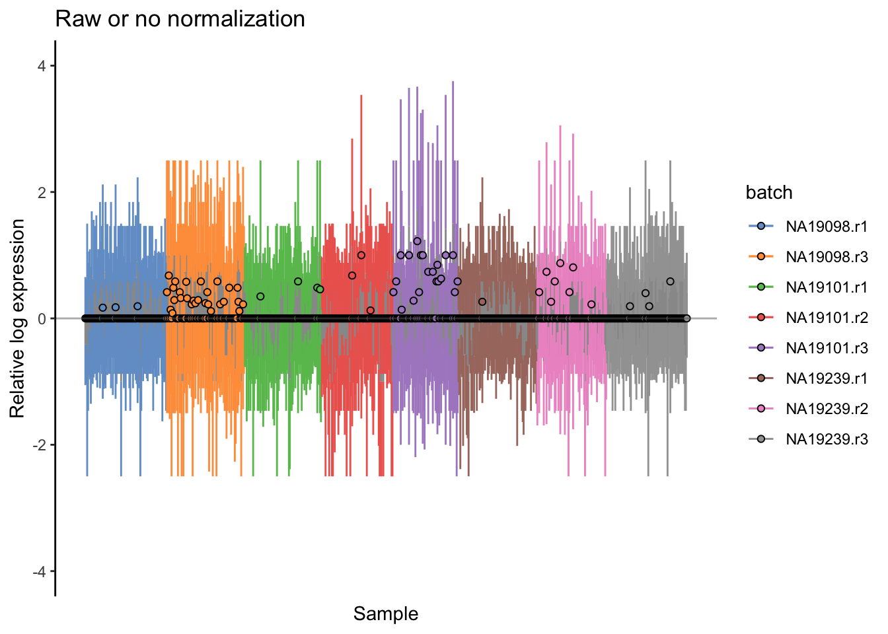

### CPM


```r
logcounts(umi.qc) <- log2(calculateCPM(umi.qc, exprs_values = "counts", 
                                       use_size_factors = FALSE) + 1)
plotPCA(
    umi.qc[endog_genes, ],
    colour_by = "batch", 
    size_by = "total_features_by_counts",
    shape_by = "individual", 
    run_args = list(exprs_values="logcounts")
)
```

<div class="figure" style="text-align: center">

<p class="caption">(\#fig:norm-pca-cpm)PCA plot of the tung data after CPM normalisation</p>
</div>


```r
plotRLE(
    umi.qc[endog_genes, ], 
    exprs_values = "logcounts",
    exprs_logged = TRUE,
    colour_by = "batch") + 
  ggtitle("After CPM normalization") + ylim(-4,4)
```

<div class="figure" style="text-align: center">
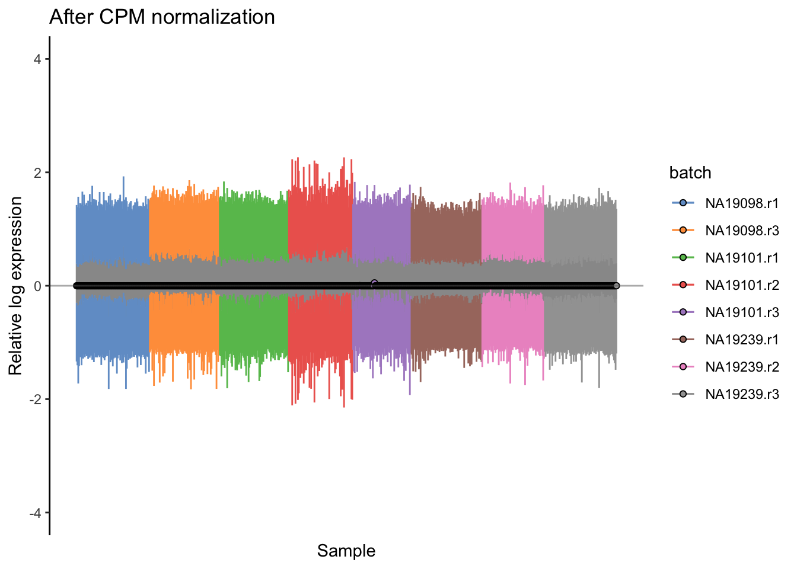
<p class="caption">(\#fig:norm-ours-rle-cpm)Cell-wise RLE of the tung data</p>
</div>


### scran

A normalization method developed specifically for scRNA-seq 
data is in the `scran` R/Bioconductor package from 
[Lun et al. (2018)](https://genomebiology.biomedcentral.com/articles/10.1186/s13059-016-0947-7). 

Because there are so many zeros in scRNA-seq data, calculating 
scaling factors for each cell is not straightforward. The idea is to 
sum expression values across pools of cells, and the summed values 
are used for normalization. Pool-based size factors are then deconvolved 
to yield cell-based factors. 

This approach (and others that have been developed specifically for 
scRNA-seq) has been shown to be [more accurate](https://www.ncbi.nlm.nih.gov/pmc/articles/PMC5549838/)
than methods developed for bulk RNA-seq. These normalization approaches
improve the results for downstream analyses. 


```r
library(scran)
qclust <- quickCluster(umi.qc, min.size = 30)
umi.qc <- computeSumFactors(umi.qc, sizes = 15, clusters = qclust)
umi.qc <- normalize(umi.qc)
plotPCA(
    umi.qc[endog_genes, ],
    colour_by = "batch",
    size_by = "total_features_by_counts",
    shape_by = "individual"
)
```

<div class="figure" style="text-align: center">
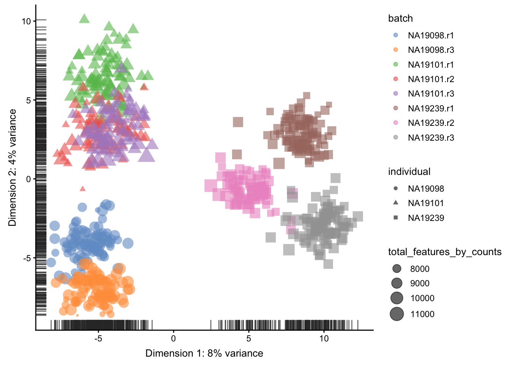
<p class="caption">(\#fig:norm-pca-lsf)PCA plot of the tung data after LSF normalisation</p>
</div>

```r
plotRLE(
    umi.qc[endog_genes, ], 
    exprs_values = "logcounts",
    exprs_logged = TRUE,
    colour_by = "batch"
) + ggtitle("After scran normalization") + ylim(-4,4)
```

<div class="figure" style="text-align: center">

<p class="caption">(\#fig:norm-ours-rle-scran)Cell-wise RLE of the tung data</p>
</div>

**Note**: `scran` sometimes calculates negative or zero size factors. 
These will completely distort the normalized expression matrix. 

We can check the size factors scran has computed like so:

```r
summary(sizeFactors(umi.qc))
```

```
##    Min. 1st Qu.  Median    Mean 3rd Qu.    Max. 
##  0.4671  0.7787  0.9483  1.0000  1.1525  3.1910
```

For this dataset all the size factors are reasonable so we 
are done. If you find `scran` has calculated negative size 
factors try increasing the cluster and pool sizes until 
they are all positive.


## Dealing with confounders

### Introduction

In the previous section we normalized for library size, 
effectively removing it as a confounder. Now we will consider
removing other less well defined confounders from our data. 
Technical confounders (aka batch effects) can arise from 
difference in reagents, isolation methods, the lab/experimenter 
who performed the experiment, even which day/time the experiment
was performed. Accounting for technical confounders, and batch 
effects particularly, is a large topic that also involves
principles of experimental design. Here we address approaches 
that can be taken to account for confounders when the experimental 
design is appropriate.

Fundamentally, accounting for technical confounders involves 
identifying and, ideally, removing sources of variation in the
expression data that are not related to (i.e. are confounding)
the biological signal of interest. Various approaches exist, 
some of which use spike-in or housekeeping genes, and some of
which use endogenous genes.

#### Advantages and disadvantages of using spike-ins to remove confounders

The use of spike-ins as control genes is appealing, since the 
same amount of ERCC (or other) spike-in was added to each cell
in our experiment. In principle, all the variablity we observe 
for these genes is due to technical noise; whereas endogenous 
genes are affected by both technical noise and biological 
variability. Technical noise can be removed by fitting a 
model to the spike-ins and "substracting" this from the
endogenous genes. There are several methods available 
based on this premise (eg. [BASiCS](https://github.com/catavallejos/BASiCS),
[scLVM](https://github.com/PMBio/scLVM),
[RUVg](http://bioconductor.org/packages/release/bioc/html/RUVSeq.html));
each using different noise models and different fitting procedures. 
Alternatively, one can identify genes which exhibit significant 
variation beyond technical noise (eg. Distance to median, 
[Highly variable genes](http://www.nature.com/nmeth/journal/v10/n11/full/nmeth.2645.html)).
However, there are issues with the use of spike-ins for 
normalisation (particularly ERCCs, derived from bacterial
sequences), including that their variability can, for 
various reasons, actually be *higher* than that of endogenous genes.

Given the issues with using spike-ins, better results can often 
be obtained by using endogenous genes instead. Where we have a 
large number of endogenous genes that, on average, do not vary 
systematically between cells and where we expect technical 
effects to affect a large number of genes (a very common and
reasonable assumption), then such methods (for example, the
RUVs method) can perform well. 

We explore both general approaches below.


```r
library(kBET)
library(sva) # Combat
library(edgeR)
```

Factors contributing to technical noise frequently appear as "batch
effects" where cells processed on different days or by different
technicians systematically vary from one another. Removing technical
noise and correcting for batch effects can frequently be performed
using the same tool or slight variants on it.

In the following subsections, we will consider 
ComBat, the use of generalized linear models (GLMs) and 
mnnCorrect. 

### Combat

If you have an experiment with a balanced design, `Combat` can be
used to eliminate batch effects while preserving biological effects
by specifying the biological effects using the `mod` parameter.
However the `Tung` data contains multiple experimental replicates
rather than a balanced design so using `mod1` to preserve biological
variability will result in an error. 


```r
combat_data <- logcounts(umi.qc)
mod_data <- as.data.frame(t(combat_data))
# Basic batch removal
mod0 = model.matrix(~ 1, data = mod_data) 
# Preserve biological variability
mod1 = model.matrix(~ umi.qc$individual, data = mod_data) 
# adjust for total genes detected
mod2 = model.matrix(~ umi.qc$total_features_by_counts, data = mod_data)
assay(umi.qc, "combat") <- ComBat(
    dat = t(mod_data), 
    batch = factor(umi.qc$batch), 
    mod = mod0,
    par.prior = TRUE,
    prior.plots = FALSE
)
```

```
## Standardizing Data across genes
```

We could also perform `ComBat` correction accounting for other covariates 
such as `total_features_by_counts` as a co-variate. 
Store the corrected matrix in the `combat_tf` slot.


```
## Standardizing Data across genes
```

### mnnCorrect 

`mnnCorrect` [@Haghverdi2017-vh] assumes that each batch 
shares at least one biological condition with each other 
batch. Thus it works well for a variety of balanced 
experimental designs. However, the `Tung` data contains
multiple replicates for each invidividual rather than balanced
batches, thus we will normalized each individual separately. 
Note that this will remove batch effects between batches within
the same individual but not the batch effects between batches
in different individuals, due to the confounded experimental 
design. 

Thus we will merge a replicate from each individual to form
three batches. 


```r
do_mnn <- function(data.qc) {
    batch1 <- logcounts(data.qc[, data.qc$replicate == "r1"])
    batch2 <- logcounts(data.qc[, data.qc$replicate == "r2"])
    batch3 <- logcounts(data.qc[, data.qc$replicate == "r3"])
    
    if (ncol(batch2) > 0) {
        x = mnnCorrect(
          batch1, batch2, batch3,  
          k = 20,
          sigma = 0.1,
          cos.norm.in = TRUE,
          svd.dim = 2
        )
        res1 <- x$corrected[[1]]
        res2 <- x$corrected[[2]]
        res3 <- x$corrected[[3]]
        dimnames(res1) <- dimnames(batch1)
        dimnames(res2) <- dimnames(batch2)
        dimnames(res3) <- dimnames(batch3)
        return(cbind(res1, res2, res3))
    } else {
        x = mnnCorrect(
          batch1, batch3,  
          k = 20,
          sigma = 0.1,
          cos.norm.in = TRUE,
          svd.dim = 2
        )
        res1 <- x$corrected[[1]]
        res3 <- x$corrected[[2]]
        dimnames(res1) <- dimnames(batch1)
        dimnames(res3) <- dimnames(batch3)
        return(cbind(res1, res3))
    }
}

indi1 <- do_mnn(umi.qc[, umi.qc$individual == "NA19098"])
indi2 <- do_mnn(umi.qc[, umi.qc$individual == "NA19101"])
indi3 <- do_mnn(umi.qc[, umi.qc$individual == "NA19239"])

assay(umi.qc, "mnn") <- cbind(indi1, indi2, indi3)

# For a balanced design: 
#assay(umi.qc, "mnn") <- mnnCorrect(
#    list(B1 = logcounts(batch1), B2 = logcounts(batch2), B3 = logcounts(batch3)),  
#    k = 20,
#    sigma = 0.1,
#    cos.norm = TRUE,
#    svd.dim = 2
#)
```

### GLM

A general linear model is a simpler version of `Combat`. 
It can correct for batches while preserving biological effects
if you have a balanced design. In a confounded/replicate 
design biological effects will not be fit/preserved. Similar
to `mnnCorrect` we could remove batch effects from each 
individual separately in order to preserve biological 
(and technical) variance between individuals. For demonstation 
purposes we will naively correct all cofounded batch effects: 


```r
glm_fun <- function(g, batch, indi) {
  model <- glm(g ~ batch + indi)
  model$coef[1] <- 0 
  return(model$coef)
}
effects <- apply(
    logcounts(umi.qc), 
    1, 
    glm_fun, 
    batch = umi.qc$batch, 
    indi = umi.qc$individual
)
corrected <- logcounts(umi.qc) - t(effects[as.numeric(factor(umi.qc$batch)), ])
assay(umi.qc, "glm") <- corrected
```

In contrast, we can also perform GLM correction for each
individual separately and store the final corrected
matrix in the `glm_indi` slot.


Let's save the 

```r
saveRDS(umi.qc, "data/tung/umi_qc.RDS")
```


### How to evaluate and compare confounder removal strategies

A key question when considering the different methods for
removing confounders is how to quantitatively determine which 
one is the most effective. The main reason why comparisons are 
challenging is because it is often difficult to know what 
corresponds to technical counfounders and what is interesting
biological variability. Here, we consider three different 
metrics which are all reasonable based on our knowledge of 
the experimental design. Depending on the biological
question that you wish to address, it is important to choose
a metric that allows you to evaluate the confounders that are 
likely to be the biggest concern for the given situation.

#### Effectiveness 1

We evaluate the effectiveness of the normalization by inspecting the
PCA plot where colour corresponds the technical replicates and shape
corresponds to different biological samples (individuals). Separation
of biological samples andinterspersed batches indicates that 
technical variation has beenremoved. We always use log2-cpm 
normalized data to match the assumptions of PCA.


```r
for(n in assayNames(umi.qc)) {
    print(
        plotPCA(
            umi.qc[endog_genes, ],
            colour_by = "batch",
            size_by = "total_features_by_counts",
            shape_by = "individual",
            run_args = list(exprs_values = n)
        ) +
        ggtitle(n)
    )
}
```

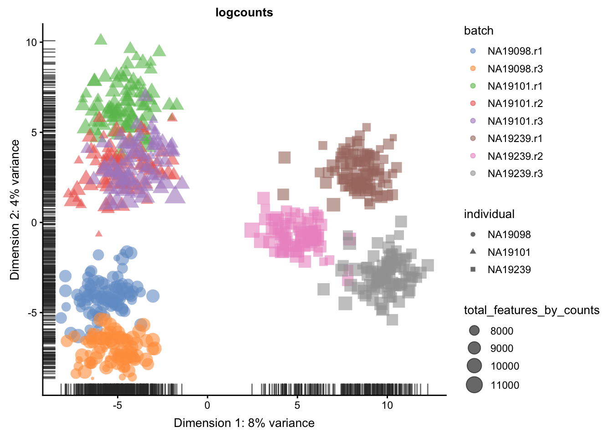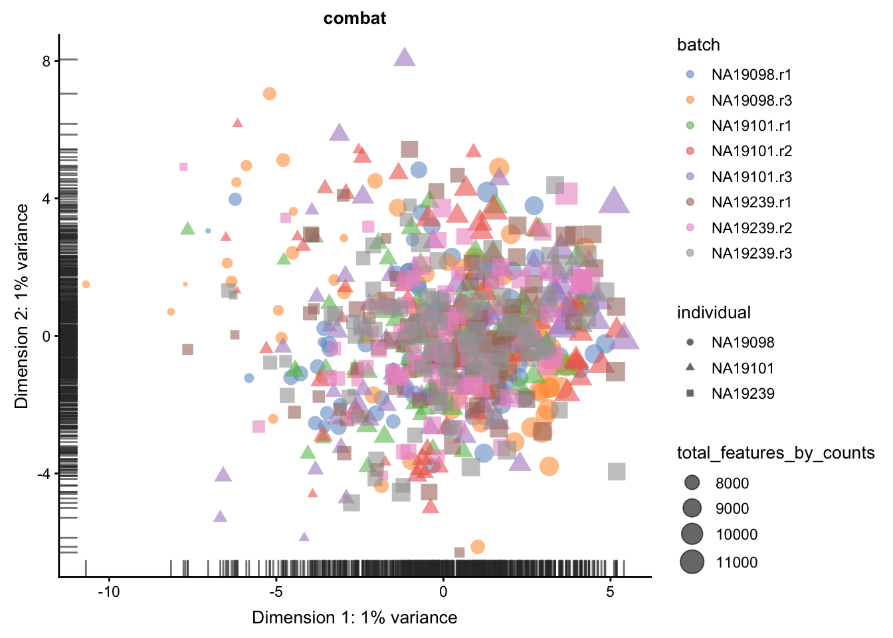


#### Effectiveness 2

We can repeat the analysis using the `plotExplanatoryVariables()`
to check whether batch effects have been removed.


```r
for(n in assayNames(umi.qc)) {
    print(
        plotExplanatoryVariables(
            umi.qc[endog_genes, ],
            variables = c(
               "total_features_by_counts",
                "total_counts",
                "batch",
                "individual",
                "pct_counts_ERCC",
                "pct_counts_MT"
            ),
            exprs_values=n) +
        ggtitle(n)
    ) 
}
```

<div class="figure" style="text-align: center">

<p class="caption">(\#fig:confound-cpm)Explanatory variables (mnn)</p>
</div><div class="figure" style="text-align: center">
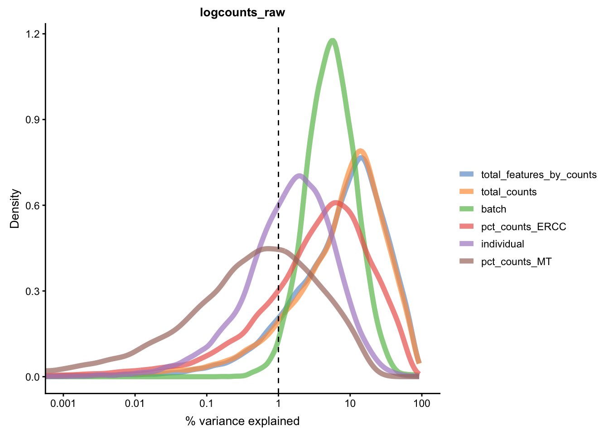
<p class="caption">(\#fig:confound-cpm)Explanatory variables (mnn)</p>
</div><div class="figure" style="text-align: center">

<p class="caption">(\#fig:confound-cpm)Explanatory variables (mnn)</p>
</div><div class="figure" style="text-align: center">

<p class="caption">(\#fig:confound-cpm)Explanatory variables (mnn)</p>
</div><div class="figure" style="text-align: center">
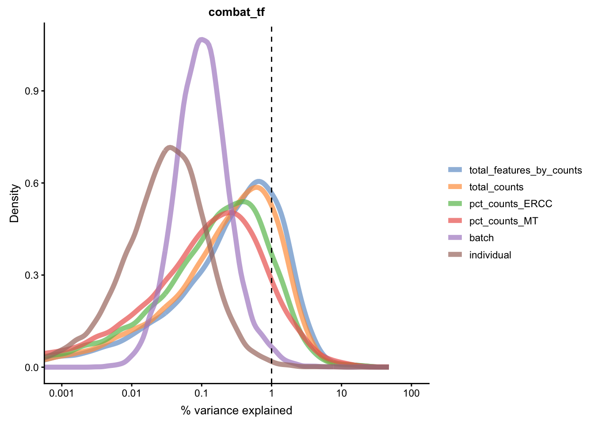
<p class="caption">(\#fig:confound-cpm)Explanatory variables (mnn)</p>
</div><div class="figure" style="text-align: center">

<p class="caption">(\#fig:confound-cpm)Explanatory variables (mnn)</p>
</div><div class="figure" style="text-align: center">

<p class="caption">(\#fig:confound-cpm)Explanatory variables (mnn)</p>
</div><div class="figure" style="text-align: center">

<p class="caption">(\#fig:confound-cpm)Explanatory variables (mnn)</p>
</div>


#### Effectiveness 3

Another method to check the efficacy of batch-effect correction 
is to consider the intermingling of points from different batches
in local subsamples of the data. If there are no batch-effects
then proportion of cells from each batch in any local region 
should be equal to the global proportion of cells in each batch. 

`kBET` [@Buttner2017-ds] takes `kNN` networks around random 
cells and tests the number of cells from each batch against a
binomial distribution. The rejection rate of these tests 
indicates the severity of batch-effects still present in the 
data (high rejection rate = strong batch effects). `kBET` 
assumes each batch contains the same complement of biological 
groups, thus it can only be applied to the entire dataset if a
perfectly balanced design has been used. However, `kBET` can
also be applied to replicate-data if it is applied to each
biological group separately. In the case of the Tung data, we
will apply `kBET` to each individual independently to check for
residual batch effects. However, this method will not identify
residual batch-effects which are confounded with biological
conditions. In addition, `kBET` does not determine if biological
signal has been preserved. 


```r
compare_kBET_results <- function(sce){
    indiv <- unique(sce$individual)
    norms <- assayNames(sce) # Get all normalizations
    results <- list()
    for (i in indiv){ 
        for (j in norms){
            tmp <- kBET(
                df = t(assay(sce[,sce$individual== i], j)), 
                batch = sce$batch[sce$individual==i], 
                heuristic = TRUE, 
                verbose = FALSE, 
                addTest = FALSE, 
                plot = FALSE)
            results[[i]][[j]] <- tmp$summary$kBET.observed[1]
        }
    }
    return(as.data.frame(results))
}

eff_debatching <- compare_kBET_results(umi.qc)
```


```r
library(reshape2)
library(RColorBrewer)

# Plot results
dod <- melt(as.matrix(eff_debatching),  value.name = "kBET")
colnames(dod)[1:2] <- c("Normalisation", "Individual")

colorset <- c('gray', brewer.pal(n = 9, "RdYlBu"))

ggplot(dod, aes(Normalisation, Individual, fill=kBET)) +  
    geom_tile() +
    scale_fill_gradient2(
        na.value = "gray",
        low = colorset[2],
        mid=colorset[6],
        high = colorset[10],
        midpoint = 0.5, limit = c(0,1)) +
    scale_x_discrete(expand = c(0, 0)) +
    scale_y_discrete(expand = c(0, 0)) + 
    theme(
        axis.text.x = element_text(
            angle = 45, 
            vjust = 1, 
            size = 12, 
            hjust = 1
        )
    ) + 
    ggtitle("Effect of batch regression methods per individual")
```


